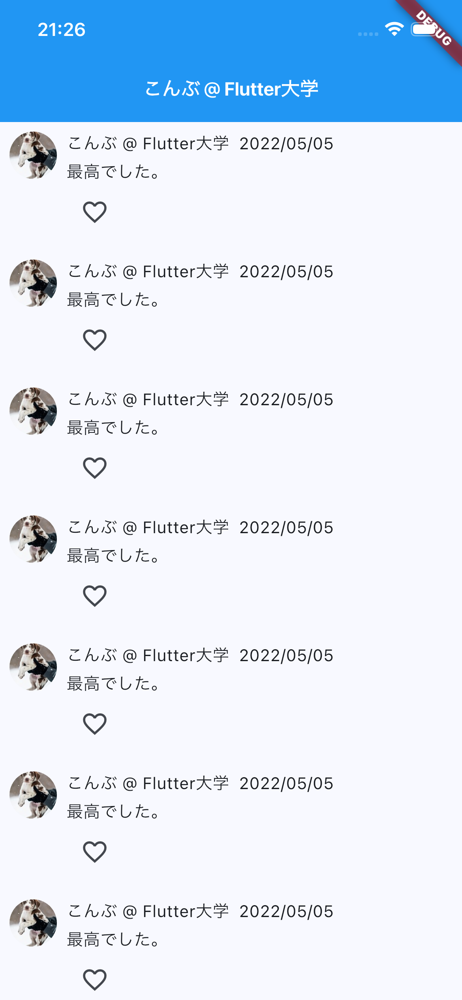
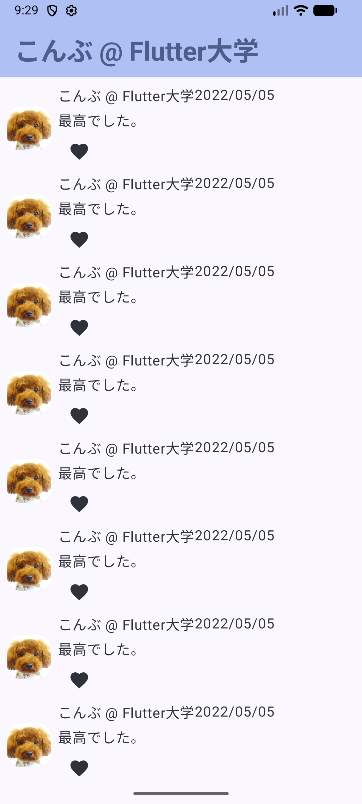

# Flutter学習

## 開発環境

- MacOS: 26.1
- Visual Studio Code: 1.107.0
- Flutter: 3.38.5
- Dart: 3.10.4
- Android SDK: 36.1.0
- Xcode: 26.2

## 学習内容

- [Flutterの教科書 by Flutter大学](https://zenn.dev/flutteruniv/books/flutter-textbook/viewer/index)

## 成果物

### [Twitter風アプリ](./twitter_like/)
- 学習項目
  - [Widgetの基礎『Twitter UI』](https://zenn.dev/flutteruniv/books/flutter-textbook/viewer/make-twitter-ui)
- 動画からの改善点
  - 動画ではAppBarの背景色が青だが、開発環境(Flutter: 3.38.5)ではMaterial3が有効になって背景色がSurfaceColorに変更されている
    - Flutter3.16からMaterial3がデフォルトで有効になったので動画とデザインを合わせるためにMaterial3へのmigration対応した
    - ref: https://docs.flutter.dev/release/breaking-changes/material-3-migration
- 動作確認
  - 端末: iPhone 16e 26.2(Simulator)
  - !
  - [source](./twitter_like/lib/main.dart)
- Android Jetpack Composeでも作ってみた
  - 端末: Android 16(Simulator)
  - !
  - [source](./TwitterLike/app/src/main/java/com/example/twitterlike/MainActivity.kt)
### [じゃんけんアプリ](./janken/)
- 学習日
  - 2026/1/13
- 学習項目
  - [Chapter 08
変数・関数・条件分岐の基礎『じゃんけん』](https://zenn.dev/flutteruniv/books/flutter-textbook/viewer/make-janken-game)
  - 実践課題Aまで
- 動画からの改善点
  - 出す手(グーチョキパー)をenumとして定義して別ファイルに切り出した
  - コンピュータがランダムに出す手や勝敗判定は出す手の定義に含めるよう修正した
  - 勝敗の文字列をenumとして定義して別ファイルに切り出した
  - 出す手は３つあるのでコンポーネントがして別ファイルに切り出した
  - アクセシビリティ対応(途中)
  - 動画ではAppBarの背景色が青だが、開発環境(Flutter: 3.38.5)ではMaterial3が有効になって背景色がSurfaceColorに変更されている
    - Flutter3.16からMaterial3がデフォルトで有効になったので動画とデザインを合わせるためにMaterial3へのmigration対応した
    - ref: https://docs.flutter.dev/release/breaking-changes/material-3-migration
- 動作確認
  - 端末: iPhone 16e 26.2(Simulator)
  - <video src="https://github.com/user-attachments/assets/0d0e2105-58c9-4ab1-b5a2-1e9b14f46ab6" controls="true" />

### [フリー画像検索アプリ](./pixabay/)
- 学習日
  - 2026/1/15
- 学習項目
  - [フリー画像検索アプリ【前編】](https://zenn.dev/flutteruniv/books/flutter-textbook/viewer/search-free-image-1)
  - [フリー画像検索アプリ【後編】](https://zenn.dev/flutteruniv/books/flutter-textbook/viewer/search-free-image-2)
  - [フリー画像検索アプリ【改善】](https://zenn.dev/flutteruniv/books/flutter-textbook/viewer/search-free-image-3)
  - 実践課題Aまで  
- 動画からの改善点
  - ソートボタンを追加して、ソートボタンタップでいいね数の多い順にソートされるように修正した
  - APIキーを環境変数から取得するよう修正した
    - `.env`ファイルを作成して、`PIXABAY_API_KEY=[YOUR_API_KEY]`を追加してください
  - class毎にファイルを分けた
  - APIレスポンスの変換処理を個々のMapデータではなく、Mapのリスト毎変換する処理を追加した
  - 動画ではAppBarの背景色が青だが、開発環境(Flutter: 3.38.5)ではMaterial3が有効になって背景色がSurfaceColorに変更されている
    - Flutter3.16からMaterial3がデフォルトで有効になったので動画とデザインを合わせるためにMaterial3へのmigration対応した
    - ref: https://docs.flutter.dev/release/breaking-changes/material-3-migration
  - Share.shareFilesは4.5.0でdeprecatedされたため、SharePlus.instance.shareに修正した
    - [https://pub.dev/packages/share_plus](https://pub.dev/packages/share_plus/changelog#450)　
- 動作確認
  - 端末: iPhone 16e 26.2(Simulator)
  - <video src="https://github.com/user-attachments/assets/ee54431d-6751-42df-bd92-e33baeff5bc0" controls="true" />
### [人生カウンター](./life_counter/)
- 学習日
  - 2026/1/19
- 学習項目
  - [データベースの基礎『人生カウンター』](https://zenn.dev/flutteruniv/books/flutter-textbook/viewer/life-counter)
- 動画からの改善点
  - 動画ではAppBarの背景色が青だが、開発環境(Flutter: 3.38.5)ではMaterial3が有効になって背景色がSurfaceColorに変更されている
    - Flutter3.16からMaterial3がデフォルトで有効になったので動画とデザインを合わせるためにMaterial3へのmigration対応した
    - ref: https://docs.flutter.dev/release/breaking-changes/material-3-migration
  - pageを別ファイルに分割した
  - `-1`ボタンを追加してカウントダウンできる様にした
- 動作確認
  - 端末: iPhone 16e 26.2(Simulator)
  - <video src="https://github.com/user-attachments/assets/084fc449-6cde-442b-b173-79e9be07fa59" controls="true" />
### [Firebaseの基礎『チャット』](./chat/)
- 学習日
  - 2026/1/20
- 学習項目
  - [Firebaseの基礎『チャット』【前編】](https://zenn.dev/flutteruniv/books/flutter-textbook/viewer/make-chat)
  - [Firebaseの基礎『チャット』【後編】](https://zenn.dev/flutteruniv/books/flutter-textbook/viewer/update-chat)
- 動画からの改善点
  - 動画ではAppBarの背景色が青だが、開発環境(Flutter: 3.38.5)ではMaterial3が有効になって背景色がSurfaceColorに変更されている
    - Flutter3.16からMaterial3がデフォルトで有効になったので動画とデザインを合わせるためにMaterial3へのmigration対応した
    - ref: https://docs.flutter.dev/release/breaking-changes/material-3-migration
  - チャット画面表示時と新規投稿した時は一番下にスクロールするように修正
- 動作確認
  - Android 16(Simulator)